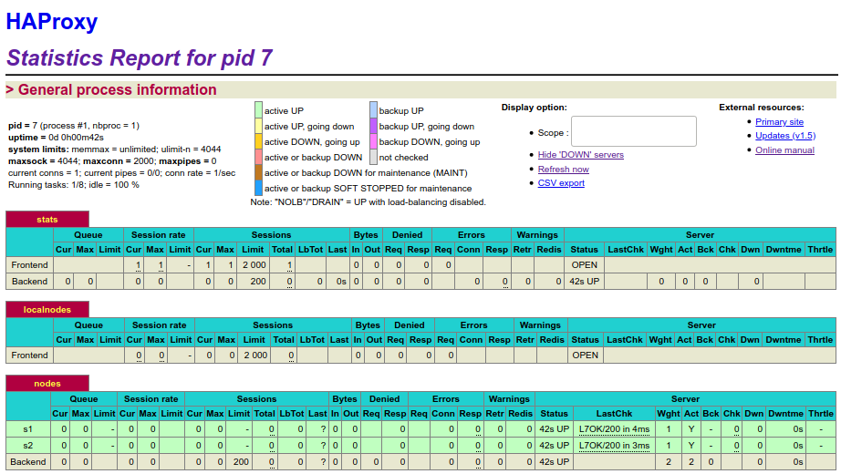
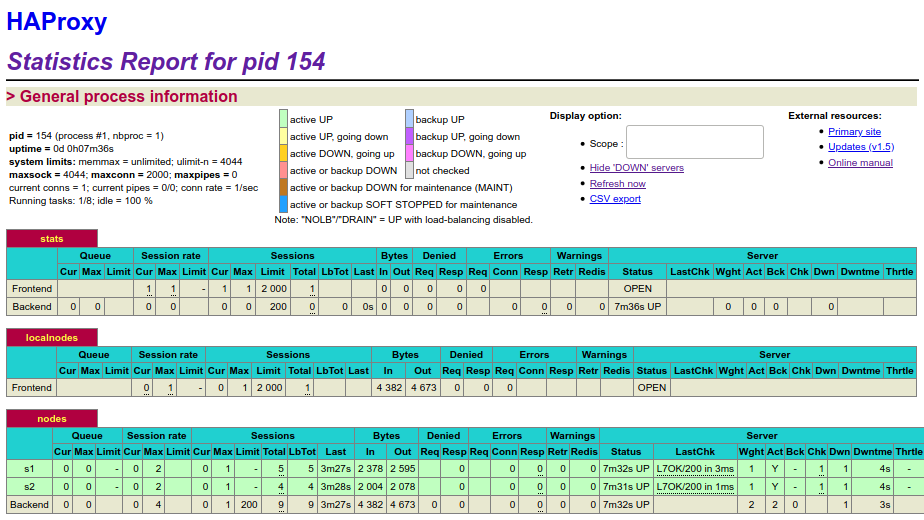
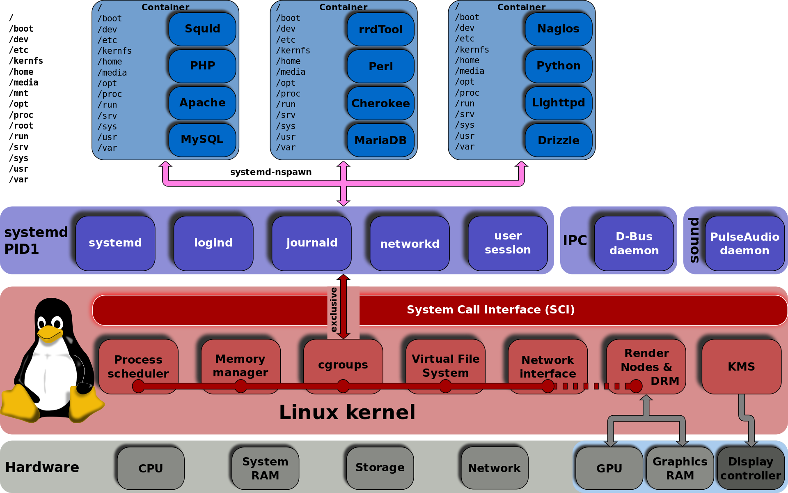
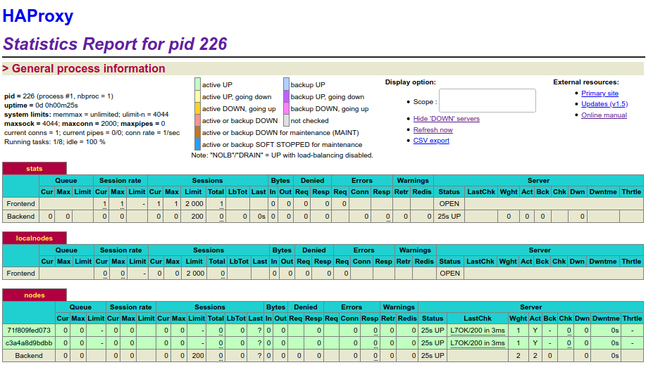
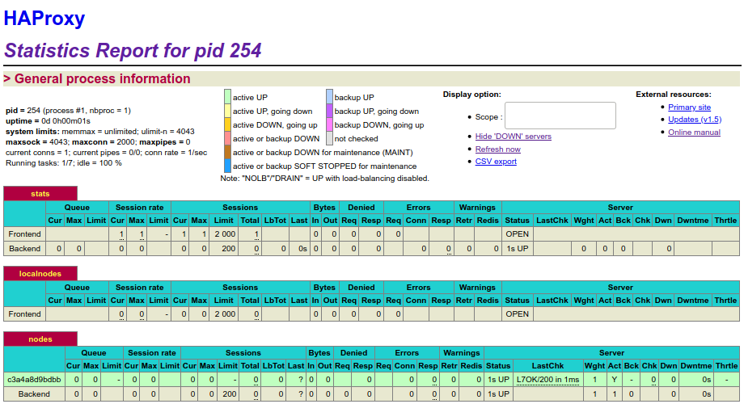
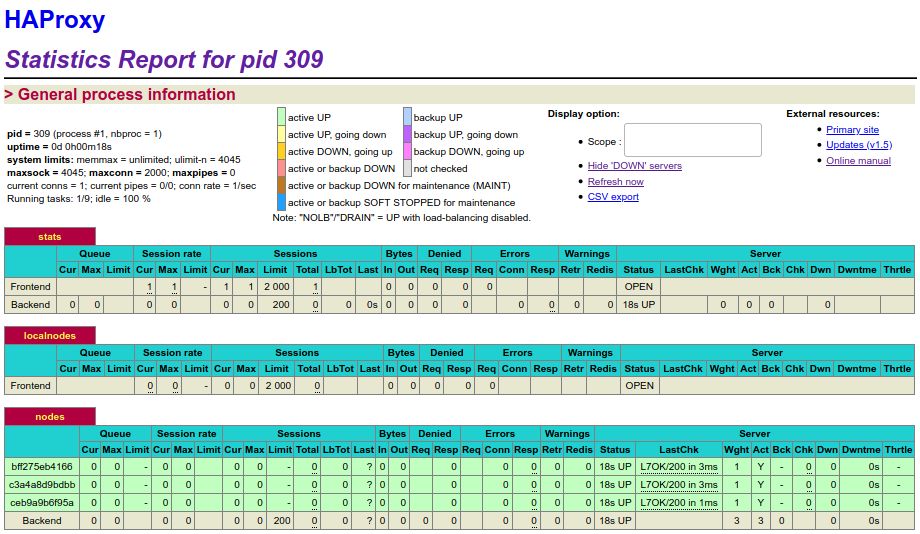

## Lab 04 - Docker

Authors : Caroline Monthoux, Rémi Poulard

Date : 07.01.2020

[TOC]

### Introduction

During this lab, we had the opportunity to discover Serf and cluster membership in Docker. Especially, we experienced the importance of dynamic configuration in a cluster and the mechanisms implemented for event propagation and failure detection.

We discovered how Docker images are built from layers and which techniques exist to manipulate these layers. We also tried out a process supervisor for Docker.


### Task 0: Identify issues and install the tools

#### Identify issues

> **[M1]** Do you think we can use the current solution for a production environment? What are the main problems when deploying it in a production environment?

The solution is not suitable for a real production environment likely to receive a high number of requests. If the load balancer container crashes, there is no backup solution : next requests will fail to reach one of the servers.


> **[M2]** Describe what you need to do to add new `webapp` container to the infrastructure. Give the exact steps of what you have to do without modifying the way the things are done. Hint: You probably have to modify some configuration and script files in a Docker image.

`webapp1` and `webapp2` are docker containers, coming from the same docker image and using the same `Dockerfile` (located in `/webapp`). They are both defined in the file `docker-compose.yml`.

Actually, these two web application servers are defined in HAProxy configuration file as nodes to be included in the balancing mechanism.

In order to add a new webapp container to the infrastructure, we took the following steps :

1. Add a new `webapp3` service in `docker-compose.yml` located in the project root directory.

```dockerfile
services:
	webapp3:
       container_name: ${WEBAPP_3_NAME}
       build:
         context: ./webapp
         dockerfile: Dockerfile
       networks:
         heig:
           ipv4_address: ${WEBAPP_3_IP}
       ports:
         - "4002:3000"
       environment:
            - TAG=${WEBAPP_3_NAME}
            - SERVER_IP=${WEBAPP_3_IP}
```

2. Since we used environment variables (`${}`), we need to define them in the **hidden** file `.env`, also located in the project root directory.

```bash
WEBAPP_3_NAME=s3
WEBAPP_3_IP=192.168.42.33
```

3. Now, we have to add the new webapp in `/ha/config/haproxy.cfg` as a node.

```bash
server s3 ${WEBAPP_3_IP}:3000 check
```


> **[M3]** Based on your previous answers, you have detected some issues in the current solution. Now propose a better approach at a high level.

Actually, it is impossible to add a new web application server dynamically.

The solution would be to allow HAProxy to include a new node when a new server is available. Practically, when a new web application container would be created, it could send the load balancer a message saying that it is available and ready to be used as a node.


> **[M4]** You probably noticed that the list of web application nodes is hardcoded in the load balancer configuration. How can we manage the web app nodes in a more dynamic fashion?

A solution would be to use a tool like `Serf`, offering cluster membership, failure detection and orchestration. The load balancer could benefit from an efficient lightweight `gossip protocol` to communicate with nodes and exchange messages periodically.


> **[M5]** In the physical or virtual machines of a typical infrastructure we tend to have not only one main process (like the web server or the load balancer) running, but a few additional processes on the side to perform management tasks.
>
> For example to monitor the distributed system as a whole it is common to collect in one centralized place all the logs produced by the different machines. Therefore we need a process running on each machine that will forward the logs to the central place. (We could also imagine a central tool that reaches out to each machine to gather the logs. That's a push vs. pull problem.) It is quite common to see a push mechanism used for this kind of task. 
>
> Do you think our current solution is able to run additional management processes beside the main web server / load balancer process in a container? If no, what is missing / required to reach the goal? If yes, how to proceed to run for example a log forwarding process?

We think that it is not actually possible to run an additional management process beside the container main process. Our Docker containers are not capable of running multiple processes, making it hard to centralize the logs in one place.

Like said on this [docker docs page](https://docs.docker.com/config/containers/multi-service_container/), there are a few different ways to accomplish this :

* Put all the commands in a wrapper script and run it as `CMD` in the Dockerfile
* **Use a process manager** like `supervisord`


> **[M6]** In our current solution, although the load balancer configuration is changing dynamically, it doesn't follow dynamically the configuration of our distributed system when web servers are added or removed. If we take a closer look at the `run.sh` script, we see two calls to `sed` which will replace two lines in the `haproxy.cfg` configuration file just before we start `haproxy`. You clearly see that the configuration file has two lines and the script will replace these two lines.
> 
>What happens if we add more web server nodes? Do you think it is really dynamic? It's far away from being a dynamic configuration. Can you propose a solution to solve this?

The load balancer doesn't know when a configuration changes or when a node goes online/offline. A new node could replace a crashed node and the load balancer would not know it.

Like said before, there are solutions like `Serf` to maintain cluster membership lists and execute custom handler scripts when that membership changes. For example, `Serf` can maintain the list of web servers for a load balancer and notify that load balancer whenever a node comes online or goes offline.


#### Install the tools

**Deliverables**:

> 1. Take a screenshot of the stats page of HAProxy at <http://192.168.42.42:1936>. You should see your backend nodes.



> 2. Give the URL of your repository URL in the lab report.

[https://github.com/Tsimwi/Teaching-HEIGVD-AIT-2019-Labo-Docker](https://github.com/Tsimwi/Teaching-HEIGVD-AIT-2019-Labo-Docker)


### Task 1: Add a process supervisor to run several processes

**Deliverables**:

> 1. Take a screenshot of the stats page of HAProxy at <http://192.168.42.42:1936>. You should see your backend nodes. It should be really similar to the screenshot of the previous task.



> 2. Describe your difficulties for this task and your understanding of what is happening during this task. Explain in your own words why are we installing a process supervisor. Do not hesitate to do more research and to find more articles on that topic to illustrate the problem.

We want to run multiple processes on the same container. The problem is that the mantra of Docker is `one process per container`, so we need to find a way to bypass this. 

In order to do it, we can use a process supervisor. Its process will have the PID 1 and it will be responsible for launching other processes.



As we can see above, `systemd` starts right after the kernel and manages other services.


### Task 2: Add a tool to manage membership in the web server cluster

**Deliverables**:

> 1. Provide the docker log output for each of the containers: `ha`, `s1` and `s2`. You need to create a folder `logs` in your repository to store the files separately from the lab report. For each lab task create a folder and name it using the task number. No need to create a folder when there are no logs.
>
>    Example :
>
>    ```bash
>    |-- root folder
>      |-- logs
>        |-- task 1
>        |-- task 3
>        |-- ...
>    ```

See [ha logs](../logs/task2/ha.png), [s1 logs](../logs/task2/s1.png) and [s2 logs](../logs/task2/s2.png).

> 2. Give the answer to the question about the existing problem with the current solution.

We think that the problem starts with the following line of the `/serf/run.sh` script.

```bash
COMMAND="$COMMAND --join ha"
```

When it is executed, the node tries to resolve `ha` name into an IP address. We tested the following cases to see when problems are raised or not :

* **`ha` is started, then `s1` and `s2`** : there is no problem in this situation. Because `ha` created a cluster on startup, `s1` and `s2` are able to join it.
* **`ha` is started, then `s1`. Then `ha` leaves the cluster while `s2` joins it** : since `s1` is still in the `ha` cluster and `ha` is still up, `s2` is able to join the cluster. When `s2` resolves the name `ha`, it is redirected to `s1` still in the cluster.
* **`ha` is started, then `s1`. Then `ha` is shutdown while `s2` joins the cluster** : this time, `s2` fails to join the  `ha` cluster. Indeed, `s2` fails to resolve the name `ha` since the node is down.
* **`s1` and `s2` are started, then `ha` :** here, `s1` and `s2` both fail to join the `ha` cluster since `ha` is down and has not created it yet.

> 3. Give an explanation on how `Serf` is working. Read the official website to get more details about the `GOSSIP` protocol used in `Serf`. Try to find other solutions that can be used to solve similar situations where we need some auto-discovery mechanism.

Once started, a `serf` node either join an existing cluster or start a new one. To join an existing cluster, a node only needs to be given the name/address of an existing member of this cluster. For example, if `ha` and `s1` are in the same cluster, `s2` can be given either `s1` or `ha` address to join them.

Then, the new member synchronizes its state with the existing member over TCP. Once done, it can begin gossiping its existence to the cluster over UDP, using `gossip` protocol. 

Gossip is done at regular intervals, ensuring constant network usage. Failure detection is also done by periodic random probing. `Serf` has a dedicated gossip layer, separated from the failure detection protocol, allowing to have a higher gossip rate and a slower failure detection rate.

If a failing node is discovered, random other nodes are asked to probe the failing node, in case there where network issues with the first node. A failing node first become *suspicious* before being considered *dead*, and all these state changes are gossiped to the cluster.

For example, in the [NeighbourCast](http://www.actapress.com/PDFViewer.aspx?paperId=31994) algorithm, instead of talking to random nodes, information is spread by talking only to neighboring nodes.

There is also [Consul](https://www.consul.io) that works like `Serf`. Consul is a tool for service discovery and configuration. It provides high level features such as service discovery, health checking and key/value storage. It makes use of a group of strongly consistent servers to manage the data center.

### Task 3: React to membership changes

**Deliverables**:

> 1. Provide the docker log output for each of the containers:  `ha`, `s1` and `s2`. Put your logs in the `logs` directory you created in the previous task.

[ha startup](../logs/task3/ha_startup)

[s1 while joining the cluster](../logs/task3/s1_after_join)

[ha after s1 joined the cluster](../logs/task3/ha_after_s1_join)

[s2 while joining the cluster](../logs/task3/s2_after_join)

[ha after s2 joined the cluster](../logs/task3/ha_after_s1_and_s2_join)

[s1 after s2 joined the cluster](../logs/task3/s1_after_s2_join)

> 2. Provide the logs from the `ha` container gathered directly from the `/var/log/serf.log` file present in the container. Put the logs in the `logs` directory in your repo.

[Serf cluster logs](../logs/task3/ha_serf_logs)


### Task 4: Use a template engine to easily generate configuration files

**Deliverables**:

> 1. You probably noticed when we added `xz-utils`, we have to rebuild the whole image which took some time. What can we do to mitigate that? Take a look at the Docker documentation on [image layers](https://docs.docker.com/engine/userguide/storagedriver/imagesandcontainers/#images-and-layers). Tell us about the pros and cons to merge as much as possible of the command. In other words, compare:
> 
> ```
> RUN command 1
> RUN command 2
> RUN command 3
>```
> 
> vs.
> 
> ```
> RUN command 1 && command 2 && command 3
>```
> 
>There are also some articles about techniques to reduce the image size. Try to find them. They are talking about `squashing` or `flattening` images.

A Docker image is built up from a series of layers. Each layer : 

* represents an instruction in the image’s Dockerfile
* is read-only, except the very last one
* is only a set of differences from the layer before it

The layers are stacked on top of each other. When we create a new container, we add a new writable layer on top of the underlying layers. This layer is often called the “container layer”. All changes made to the running container, such as writing new files, modifying existing files, and deleting files, are written to this thin writable container layer. Layers can be shared by container if they need the same usage.

If we chain commands like in the first example, it will create 3 different layers. All of them could be reused by other containers, but there will be still 3 different layers that will take a certain amount of space. 

In the second example, only one layer will contain all the information. So, if other containers want to use this layer, they will need to have the exact same line in their Dockerfile.

About techniques to reduce image size, `squashing` an image means that all layers of a running container are taken and made into a unique custom layer. [This link](http://jasonwilder.com/blog/2014/08/19/squashing-docker-images/) provides a full explanation of the process and a tool, `docker-squash`, to do it.

On the other side, `flattening` a container means that we are going to hide all the layers in one. For example, if the Dockerfile contains a secret environment variable, it would be easy to extract that specific layer (with its ID) to discover the secret. The problem also could be that the image is too big and we want to reduce its size.

To flatten a container, we simply have to export it and then import it as a pipeline. In fact, when we export a container, it will lose its history, making it impossible to browse its layer history. More information [here](https://medium.com/@l10nn/flattening-docker-images-bafb849912ff) and [here](https://tuhrig.de/flatten-a-docker-container-or-image/).

> 2. Propose a different approach to architecture our images to be able to reuse as much as possible what we have done. Your proposition should also try to avoid as much as possible repetitions between your images.

The idea would be to make as much as possible the same layers in all containers. 

For that, we should provide the same commands in the Dockerfiles. For example, if all containers need common packages, we will write a one-line command that install these packages. 

We could also make a custom image with `Serf` and `s6` installed by default, and then provide custom commands in the Dockerfiles (squashing).

> 3. Provide the `/tmp/haproxy.cfg` file generated in the `ha` container after each step.  Place the output into the `logs` folder like you already did for the Docker logs in the previous tasks. Three files are expected.
>    
>    In addition, provide a log file containing the output of the  `docker ps` console and another file (per container) with `docker inspect <container>`. Four files are expected.

[haproxy.cfg after ha joined the cluster](../logs/task4/ha_1)

[haproxy.cfg after s1 joined the cluster](../logs/task4/ha_2)

[haproxy.cfg after hs2 joined the cluster](../logs/task4/ha_3)

[docker ps](../logs/task4/docker_ps)

[docker inspect ha](../logs/task4/inspect_ha)

[docker inspect s1](../logs/task4/inspect_s1)

[docker inspect s2](../logs/task4/inspect_s2)

We can see that we have the "history" of which node joined the cluster. 

**Note :** it would be better, in the command that writes to the log file, to append the result instead of overwriting the file. 

> 4. Based on the three output files you have collected, what can you say about the way we generate it? What is the problem if any?

One problem is, as said before, that the file is overwritten on each join event. 

Another problem is that there is no feedback about a node leaving the cluster. The same should be done in the script for a leaving node.


### Task 5: Generate a new load balancer configuration when membership changes

**Deliverables**:

> 1. Provide the file `/usr/local/etc/haproxy/haproxy.cfg` generated in the `ha` container after each step. Three files are expected. In addition, provide a log file containing the output of the `docker ps` console and another file (per container) with `docker inspect <container>`. Four files are expected.
>    

[haproxy.cfg after ha joined the cluster](../logs/task5/ha_1)

[haproxy.cfg after s1 joined the cluster](../logs/task5/ha_2)

[haproxy.cfg after s2 joined the cluster](../logs/task5/ha_3)

[docker ps](../logs/task5/docker_ps)

[docker inspect ha](../logs/task5/inspect_ha)

[docker inspect s1](../logs/task5/inspect_s1)

[docker inspect s2](../logs/task5/inspect_s2)

> 2. Provide the list of files from the `/nodes` folder inside the `ha` container. One file expected with the command output.

[nodes list](../logs/task5/ls_node)

> 3. Provide the configuration file after you stopped one container and the list of nodes present in the `/nodes` folder. One file expected with the command output. Two files are expected.
>    
>    In addition, provide a log file containing the output of the  `docker ps` console. One file expected.

[haproxy.cfg after removing one backend node](../logs/task5/config_after_removing_one_container)

[nodes list](../logs/task5/ls_node_after_removing_one)

[docker ps after removing one backend node](../logs/task5/docker_ps_after_removing_one_container)

> 4. (Optional:) Propose a different approach to manage the list of backend nodes. You do not need to implement it. You can also propose your own tools or the ones you discovered online. In that case, do not forget to cite your references.

We could use [Traefik](https://docs.traefik.io/) as reverse proxy and load balancer. It could replace the Serf cluster and match the Docker idea of one container for one service. 

Also, [Portainer](https://www.portainer.io/) could be used to manager containers. *Portainer* is a lightweight management UI which allows us to easily manage our different Docker environments.

### Task 6: Make the load balancer automatically reload the new configuration

**Deliverables**:

> 1. Take a screenshots of the HAProxy stat page showing more than 2 web applications running. Additional screenshots are welcome to see a sequence of experimentations like shutting down a node and starting more nodes.
>    
>    Also provide the output of `docker ps` in a log file. At least one file is expected. You can provide one output per step of your experimentation according to your screenshots.

At the beginning, we started 2 web applications.



Then, we removed 1 node.



Finally, we started 2 new nodes.



Here are the related docker logs :

* [2 nodes](../logs/task6/docker_ps_1)
* [1 nodes](../logs/task6/docker_ps_2)
* [3 nodes](../logs/task6/docker_ps_3)

> 2. Give your own feelings about the final solution. Propose improvements or ways to do the things differently. If any, provide references to your readings for the improvements.

This solution is fine but not the best. The problem is that if all backend nodes fail, there is no mechanism to redeploy them automatically. 

To do so, a solution would be to set a minimum number of wanted backend component. On each "leaving cluster" event, we would look if there is less backend component than the set value. If there is less node than expected, a script to redeploy N containers would be run to match the set value.

Another problem is that the reverse proxy is a one point of failure. This means that if the reverse proxy container crashes, everything will fail. 

To avoid this, a solution would be to have multiple reverse proxy containers sharing the same virtual IP. The virtual IP would be the entry point, forwarding requests to one active reverse proxy container. The others would be passive. In case of failure of the active reverse proxy, a passive one would become the new active one.


More information about Virtual IP configuration [here](https://www.digitalocean.com/community/tutorials/how-to-set-up-highly-available-haproxy-servers-with-keepalived-and-floating-ips-on-ubuntu-14-04).

> 3. (Optional:) Present a live demo where you add and remove a backend container.

To add and remove backend containers, we simply have to run the following command. 

```bash
docker-compose -f docker-compose-scale.yml up --scale webapp=N 
```

where N is the **total** number of backend containers that we want. Below are two videos to demonstrate this.

#### Add containers


#### Remove containers


### Difficulties

The instructions were sometimes not very clear. Because the laboratory has been reused over the years, some steps are not up-to-date and don't reflect the actual situation. Apart from that, we did not experience heavy difficulties doing the laboratory.

### Conclusion

At the beginning, a laboratory about `Docker` seemed redundant because we are using it since last year. However, we quickly discovered new technologies like `Serf` and `S6`. These technologies are daily used by organizations in today's working world, making this lab very useful for soon-to-be engineers.

We found that reusing `HAProxy` was a good idea to consolidate our knowledge. It ensures a certain continuity in our learning process.


